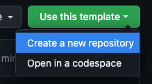

# ts-node-express-starter

[](https://github.com/google/gts)

This is a template to get started with building Node applications with Typescript and Express.

It uses Google's [gts](https://github.com/google/gts) to fix lint and formatting issues.

## Getting Started

Click on "Use this template" button to create a new repository:



For a fresh install of all the dependencies run the following from the root directory:

```bash
./scripts/install.sh
```

**_NOTE:_**  This will install the latest versions for all dependencies except in the `gts` package that will install the latest versions supported by it. Feel free to change the script to target specific versions according to your needs.

## Run with Docker

Once the dependencies have been installed, build and run the application in Docker with the following commans:

```bash
docker build . -t my-cool-app
docker run -p 127.0.0.1:8000:8000/tcp my-cool-app
```

or with Docker compose for a development enviroment start:

```bashe
docker compose up
```